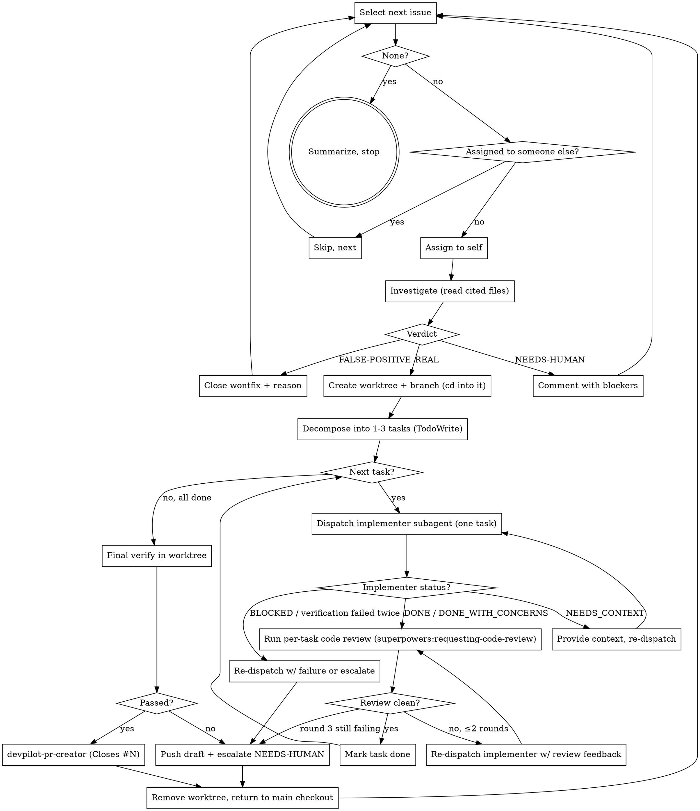

# Resolve GitHub Issues (Loop Until Done)

## Files in this skill

| File | When to load |
|---|---|
| `references/worktree-management.md` | Step 0 (preflight prune) and Step 5 (per-issue create) and the cleanup path — path scheme, create / remove, failure modes. |
| `references/verdict-comments.md` | Step 4 — exact comment bodies for the three verdicts. |
| `references/task-decomposition.md` | Step 6a — split a REAL issue into 1–3 tasks. |
| `references/subagent-spec.md` | Step 6b — the spec handed to each per-task implementer subagent. |
| `references/per-task-review.md` | Step 6c — invoke `superpowers:requesting-code-review` after each task. |

## Overview

End-to-end loop that takes open GitHub issues from triage to reviewed PR, one at a time, until the filter returns no matches. Each issue ends in exactly one of three states: **closed with reason** (false positive), **escalated with questions** (needs human), or **reviewed PR opened** (real). Nothing else is a valid terminal state.

Every REAL issue is fixed in its **own `git worktree`**, not in the main checkout. The main checkout stays on the default branch, untouched, so the user can keep working in it while the loop runs. The fix branch and all its commits live in a sibling directory at `<repo-root>.worktrees/issue-<N>-<slug>/`. See `references/worktree-management.md` for the lifecycle.

For a REAL issue, the fix itself follows the `superpowers:subagent-driven-development` pattern: decompose into a small number of tasks, dispatch one implementer subagent per task, run `superpowers:requesting-code-review` after each task. The worktree, branch, and PR are still per-issue (one worktree, one branch, one PR per issue, always), but the work that lands on that branch is gated task-by-task.

The per-task code review is the **only** review run by this loop. There is no separate published GitHub review — the per-task gate already covered code quality, architecture, testing, requirements, and production readiness on every commit that landed. The PR is opened ready-for-review for human eyes, with `Closes #N` linking back to the issue.

**Core principle:** No fix without a verdict, no fix outside a per-issue worktree, no task without a fresh implementer, no task complete without code review. Anything else breaks the loop and accrues silent debt.

## When NOT to Use

- Filing new issues from a scan → `devpilot-scanning-repos`.
- Reviewing a single PR the user already has open → `devpilot-pr-review`.
- A one-off bug report with no GitHub issue behind it → fix it directly; you don't need the loop.
- Repos where the caller lacks write access — you cannot assign, branch, or PR. Stop and tell the user.

## The loop



## Workflow

### 0. Preflight — once, not per issue

Run in parallel:

```bash
gh repo view --json nameWithOwner,defaultBranchRef   # identify repo + default branch
gh auth status                                        # must be logged in
gh api user --jq .login                               # who is "me"?
git rev-parse --abbrev-ref HEAD                       # starting branch
git rev-parse --show-toplevel                         # main checkout root — save as $MAIN
git status --porcelain                                # working tree clean?
git worktree list                                     # see existing worktrees
git worktree prune                                    # drop metadata for already-deleted worktree dirs
```

**Stop and ask the user if:**

- Working tree has uncommitted changes — commit, stash, or abort. The main checkout must be clean before the loop runs.
- `gh auth status` is not logged in.
- The repo has zero matching open issues — confirm the filter before looping on nothing.
- `git worktree list` shows existing worktrees from a prior run with **unpushed commits**. That is in-progress work, not garbage. See `references/worktree-management.md` → "Step 0 — preflight pruning". Default action: leave it alone, ask the user.

**Establish the filter.** Default: `is:open no:assignee` plus the labels the user cares about (e.g., `repo-scan`, `bug`). If the user said "all issues" but there are >20, confirm the scope before starting. Save the filter — the loop reuses it every iteration.

**Save `$MAIN` (the main checkout root).** Every cleanup step `cd`s back to `$MAIN` to remove the per-issue worktree. The loop's "home" cwd is `$MAIN`; it temporarily moves into a worktree for steps 5–9 of each REAL iteration.

### 1. Select the next issue

```bash
gh issue list \
  --state open \
  --search "<filter-terms> no:assignee sort:created-asc" \
  --limit 1 \
  --json number,title,body,labels,url,author
```

If the result is empty → go to step 12 (summarize & stop).

### 2. Assign to self

```bash
gh issue edit <num> --add-assignee @me
```

If the issue is already assigned to someone else, **skip it and move on** — do not steal assignments, even if it looks abandoned. Leave it for the owner.

### 3. Investigate — you MUST read the cited code

Read the full issue body. If the issue was filed by `devpilot-scanning-repos` it contains an `Evidence` block with a file and line range. For every verdict you render, you MUST:

- Open the cited file and read the cited line range **in the current HEAD**, not from the issue body.
- `git log --oneline -- <file>` around the cited lines — was this already fixed since the issue was filed?
- `grep`/ripgrep for callers, tests, and related constants touching the cited code.
- If the issue gives a reproduction (a command, a failing test), run it.

**A verdict based solely on reading the issue body is speculation.** Issues can be stale, scanners hallucinate, and line numbers drift.

### 4. Render a verdict — exactly one

| Verdict | When | Action |
|---|---|---|
| **REAL** | You traced the code and reproduced / confirmed the bug, gap, or risk. | Proceed to step 5. **Stay assigned** until the PR merges — `Closes #N` on merge closes the issue cleanly when it's authored by the assignee. |
| **FALSE-POSITIVE** | You traced the code and the premise is wrong — already fixed, wrong file, misread of the code, scanner hallucination, or pre-existing and intentional. | Post the FALSE-POSITIVE comment from `references/verdict-comments.md`, close with the `wontfix` label, unassign. Next issue. |
| **NEEDS-HUMAN** | Concern is real but fixing requires domain knowledge you don't have — business logic, product decisions, contracts with external services. | Post the NEEDS-HUMAN comment with 1–3 concrete questions, unassign. Next issue. |

**Do not classify as REAL just to "take a shot."** False positives close in 60 seconds; wrong REAL verdicts spawn implementer subagents that produce useless diffs and poison the PR history.

### 5. Create the per-issue worktree (and the branch inside it)

**The fix branch lives in its own worktree, never in the main checkout.** This is non-negotiable — see "Hard rules" below and `references/worktree-management.md` for the full rationale and failure-mode handling.

Slug: derive from the issue title — kebab-case, 3–5 ASCII words. Example: issue #42 "Sanitize shell input in cmd/devpilot/run.go" → slug `sanitize-shell-input`, branch `fix/issue-42-sanitize-shell-input`, worktree `<repo-root>.worktrees/issue-42-sanitize-shell-input`.

```bash
# From $MAIN. Refresh default branch, then create worktree + branch in one shot.
git fetch origin "<default-branch>"

WORKTREE="$MAIN.worktrees/issue-<num>-<slug>"
BRANCH="fix/issue-<num>-<slug>"

git worktree add -b "$BRANCH" "$WORKTREE" "origin/<default-branch>"
cd "$WORKTREE"
```

After `cd "$WORKTREE"`, every subsequent step in this iteration (6 implementers, 6c review, 7 verify, 8 PR, 9 issue comment) runs with `cwd = $WORKTREE`. Subagents you dispatch from here **inherit this cwd**, which is exactly what you want — they see the fix branch's working tree natively, no extra `cd` plumbing required.

**Failure handling** (path already exists, branch already exists, fetch failed): see `references/worktree-management.md` → "Failure modes at create time". Never `--force` past these in the autonomous loop; ask the user instead. A forced create on top of in-progress work is the kind of destructive action that requires explicit confirmation.

### 6. Fix via per-task implementers + per-task code reviews

This is the heart of the skill. Do NOT fix in the main context. The main context is the orchestrator; coding lives in implementer subagents, gating lives in reviewer subagents.

**Cwd contract for this step:** controller stays at `$WORKTREE`. Each dispatched implementer and reviewer subagent inherits that cwd, so their `git`, file paths, and `make` invocations all naturally apply to the issue's worktree. **Never `cd "$MAIN"` mid-step 6** — that would point your tooling at the default branch's working tree and confuse every subsequent dispatch.

#### 6a. Decompose into tasks

Split the fix into 1–3 sequential tasks and capture them in TodoWrite for this issue iteration. See `references/task-decomposition.md` for sizing rules and the TodoWrite shape. More than 3 tasks is a smell — escalate `NEEDS-HUMAN` instead of overflowing the loop's budget.

#### 6b. For each task, in order

For task `i` of `N`:

1. **Mark the task `in_progress`** in TodoWrite.
2. **Dispatch the implementer subagent.** Use the per-task spec from `references/subagent-spec.md`, filled in with the Evidence block, files-to-read, and acceptance criteria scoped to *this task only*. One dispatch per task. Never run implementers in parallel on the same branch.
3. **Handle the implementer's status:**
   - **DONE** — proceed to per-task review (6c).
   - **DONE_WITH_CONCERNS** — read the concerns. If they affect correctness, re-dispatch with extra context; otherwise note them and proceed to review.
   - **NEEDS_CONTEXT** — answer the question, re-dispatch with the answer appended.
   - **BLOCKED** — read the explanation. Adjust the spec, dispatch a more capable model, or escalate `NEEDS-HUMAN`. Never re-dispatch the same model with the same spec on a BLOCKED return.
   - **Verification failed inside the subagent** — one re-dispatch with the verbatim failure output. Second failure → escalate the whole issue `NEEDS-HUMAN`.

#### 6c. Per-task code review

Invoke `superpowers:requesting-code-review` against the SHA range this task produced. See `references/per-task-review.md` for the exact dispatch and how to act on findings.

- **Clean / Minor only** — mark the task `completed` in TodoWrite. Continue to the next task.
- **Important / Critical** — re-dispatch the same implementer with the reviewer's feedback verbatim (`per-task-review.md` → "Approach A"). Re-review.
- **Cap at 2 review rounds per task.** A third round means escalate the issue `NEEDS-HUMAN`.

**Per-task review is non-negotiable.** It is the only review gate in this loop — there is no later published-review step that could backstop a skipped per-task review.

#### 6d. When all tasks are completed

Continue to step 7. Do not skip the final local verify even if every per-task review was clean — the union of task diffs has not been verified together.

### 7. Final verify — yourself, not any subagent's report

Still at `cwd = $WORKTREE`. Run the project's verification commands **in the main context (controller), in the worktree**, on the fix branch:

```bash
make test
make lint
```

Or the project-specific equivalents (`go test ./...`, `pnpm test`, `cargo test`). Trust-but-verify: implementer and reviewer subagents can both misreport — innocently or because a test harness is broken.

- Everything passes → step 8.
- Anything fails → escalate the issue `NEEDS-HUMAN`: push the branch as a draft (`git push -u origin "$BRANCH"`), comment on the issue with the failing output and the branch URL, unassign, then proceed to step 10 (worktree cleanup) before the next issue. The per-task reviews already ate the retry budget; don't burn another round here.

### 8. Create the PR

Still at `cwd = $WORKTREE`. Invoke `devpilot-pr-creator`. Extra constraints this skill adds on top of that skill:

- The PR body MUST contain `Closes #<issue-num>` on its own line so GitHub auto-closes the issue on merge.
- The PR title should describe the fix, not repeat the issue number.
- Base branch = repo default, unless the user specified a different stacking target at preflight.
- Open the PR ready-for-review (not draft). The per-task code-review gate has already run on every commit; there is no separate published review pass to wait for.

`devpilot-pr-creator` runs `git push -u origin "$BRANCH"` itself; after it returns, the branch is on origin and the worktree's job is done.

### 9. Post the resolution comment on the issue

Post the **Real → PR opened** comment template from `references/verdict-comments.md` on the issue itself (not only the PR), so subscribers see the resolution trail without having to click into the PR. The issue stays open and assigned to you — `Closes #<num>` in the PR body will close it on merge.

### 10. Cleanup — remove the worktree, return to `$MAIN`

Reached on three paths: PR opened (step 8 success), final-verify failure escalation (step 7 failure after pushing draft), or mid-fix escalation (BLOCKED / round-3 review / second verification fail, after pushing draft). Never reached on FALSE-POSITIVE / NEEDS-HUMAN — those verdicts never created a worktree.

```bash
cd "$MAIN"
git worktree remove "$WORKTREE"     # try plain remove first
# If it fails on gitignored build artifacts (bin/, node_modules/, target/, etc.):
#   git -C "$WORKTREE" clean -fdX && git worktree remove "$WORKTREE"
# --force is the last resort; see references/worktree-management.md → "Cleanup policy".
git worktree prune
```

If `git worktree remove` (and `clean -fdX` retry) still fails because of modified or untracked **tracked** files that are NOT on origin, **stop and ask the user.** Don't `--force` past unpushed work — `references/worktree-management.md` → "Cleanup policy" walks the full ladder.

After this step the controller is back at `$MAIN`, the worktree directory is gone, and `git worktree list` no longer shows the issue's entry. Ready for the next iteration.

### 11. Return to step 1

### 12. Final summary

When the loop terminates, print:

```
## Issue resolution complete

Filter: <filter-terms>
Processed: <N> issues

- REAL → PR opened: <count>    (#<issue>→PR#<pr>, ...)
- FALSE-POSITIVE → closed:  <count>    (#<issue>, ...)
- NEEDS-HUMAN → escalated:  <count>    (#<issue>, ...)
- Skipped (assigned to others): <count>

Per-task stats:
- Tasks dispatched: <count>
- Re-dispatches due to review feedback: <count>
- Tasks escalated mid-fix (round-3 review or 2nd verification fail): <count>

Next: review the PRs now awaiting your eyes.
```

## Termination conditions

The loop ends when **any** of these is true — not before:

1. Step 1 returns zero matching issues.
2. The user interrupts.
3. **Three-strike rule:** three consecutive iterations resolve to NEEDS-HUMAN, failed verification, or round-3 review escalation. Something is wrong with the filter or scope — stop and ask the user before burning more time.

"I've done enough" is not a termination condition. The skill is defined as a loop. If the loop feels too long, narrow the filter — don't abandon mid-sweep.

## Hard rules

1. **One issue per PR.** Never bundle fixes across issues even when they touch the same file. Rebase conflicts are cheap; mixed-intent reviews are expensive.
2. **One implementer subagent per task, sequential, never parallel.** Multiple implementers on the same branch race on the working tree.
3. **No task is `completed` without a clean per-task code review.** `superpowers:requesting-code-review` is the only review gate this skill runs; there is no later "PR review" pass to backstop it.
4. **Cap review rounds at 2 per task; cap verification retries at 1 per task.** Round 3 / second verification fail → escalate `NEEDS-HUMAN` for the whole issue.
5. **The PR has no published GitHub review.** The per-task reviews already ran during the fix; what lands on the branch is what the human reviewer reads. Do not paste per-task review output into the PR description as a substitute — it would duplicate findings the diff already addresses.
6. **Never re-assign to someone else.** Either you resolve the issue or you unassign and leave a reasoned comment.
7. **Never edit an issue's title or body.** Comment on it. The author's words stay intact.
8. **Never mass-close.** Each FALSE-POSITIVE gets its own comment quoting the code that proves the premise wrong.
9. **Never open a PR without `Closes #N`.** The issue will stay open forever and the loop will re-pick it.
10. **Never push to `main` / the default branch.** Always work on `fix/issue-<num>-...`.
11. **Never fix in the main context.** Implementation lives in implementer subagents; review lives in `superpowers:code-reviewer` subagents. The main context orchestrates only.
12. **Every REAL issue is fixed in its own `git worktree`, never in the main checkout.** No exceptions: not for "tiny" fixes, not when worktree creation is "annoying", not when "the main checkout is already clean." The main checkout is the user's working environment; the loop never owns it. Worktree create at step 5, cleanup at step 10. See `references/worktree-management.md`.
13. **One worktree per issue, one branch per worktree, sequential issues.** Reusing a worktree across issues, or creating two worktrees for the same issue, both break the cleanup contract and leak branches. Sequential at the issue level — even though worktrees are physically isolated, this skill processes one issue at a time. Parallelizing across issues is a future change, not a license to skip.
14. **Never `--force` past a worktree-create or worktree-remove failure in autonomous mode.** Both failure modes (path collision on create, modified/untracked files on remove) usually indicate someone's in-progress work or a real disk problem. Stop and ask the user; `--force` is reserved for cases where you have *verified* (`git status`, `git log origin/$BRANCH..HEAD`) that the work is already on origin.

## Red flags — STOP and reset

**Meta-rationalization:** almost every entry below is a costume for the same pressure: *"the queue is piling up,"* *"this one is special,"* *"the user is asleep,"* *"it'd be faster."* If your reasoning leans on queue depth, time pressure, or the user's absence to justify deviating from a rule, that's the trap — not the situation. The cost of one rule-violating shortcut is never that one issue; it's that the loop forgets the rule the next time.

| Thought | What's actually happening |
|---|---|
| "I'll just fix this without reading the cited file" | Verdict without investigation = guessing. Read the file at current HEAD first. |
| "This fix is one line — skip task decomposition, skip per-task review" | One-line fixes pass code review in 30 seconds. Skipping it teaches the loop to skip more. The minimum is still 1 task + 1 review. |
| "I'll dispatch the whole fix as one big subagent task — faster" | Whole-issue subagents leave no checkpoint until the end and skip the per-task gate. Decompose first. |
| "Tasks are independent — dispatch implementers in parallel" | Same branch, same working tree. Sequential only. `superpowers:subagent-driven-development` warns against this for the same reason. |
| "The implementer self-reviewed before returning DONE — that counts" | Same context, same blind spots. The fresh `superpowers:code-reviewer` subagent has no shared history; that is the point. |
| "Reviewer found one Minor — I'll fix it myself in the controller" | Context pollution. Re-dispatch the implementer with the feedback. |
| "Reviewer keeps finding things — let me try one more round" | Round 3 = the task is fighting the codebase or the spec is wrong. Escalate `NEEDS-HUMAN`, don't burn the loop. |
| "Assignment is just ceremony, skip it" | Two agents on the same issue = two PRs and a race. Assign. |
| "Let me batch these three related issues into one PR" | The next reviewer, and the next `/resolve-issues` run, can no longer separate them. One PR per issue. |
| "Per-task reviews don't get posted anywhere — let me also run a published review on the PR" | The per-task gate already ran. Posting a second review duplicates findings that have either been fixed or accepted. If you want a published review for an unrelated PR, use `devpilot-pr-review` directly outside this loop. |
| "Close as FALSE-POSITIVE, nobody will notice the weak reasoning" | You will notice in 4 weeks when the same scanner refiles it. Quote the code or reclassify. |
| "I've done two issues — I'll stop" | The skill is defined as a loop until empty or three-strike. Either narrow the filter or continue. |
| "The implementer said tests pass, so I don't need to run them at step 7" | Subagents misreport. Run the commands yourself. |
| "I'll skip `Closes #N` since the PR title mentions the issue" | Title text doesn't autolink. Without the magic word the issue stays open. |
| "I'll assign and then un-assign later if I don't fix it" | Unassign in the same iteration the verdict demands it (FALSE-POSITIVE / NEEDS-HUMAN). Dangling assignments leak. |
| "Just one issue this run — I'll skip the worktree dance and branch in the main checkout" | The main checkout is the user's. The loop never owns it. Worktree create is two commands; the cost of skipping is the user's editor / dev server colliding with your fix branch the moment you `cd` away. |
| "Worktree create failed with 'already exists' — I'll `git worktree remove --force` and retry" | "Already exists" usually means an in-progress branch from a prior run, not garbage. Inspect `git worktree list` and the branch's commits before any `--force`. |
| "I'll create the worktree but stay in `$MAIN` and pass `-C "$WORKTREE"` to git" | Then every subagent gets the wrong cwd and tries to operate on the main checkout. `cd "$WORKTREE"` once at step 5 and stay there until step 10. |
| "Cleanup is bookkeeping; I'll batch it at the end of the loop" | A loop that processes 10 issues should never have 10 worktrees alive. Cleanup is per-iteration. Batching cleanup is hoarding state across iterations the loop is not designed to hold. |
| "`git stash` in the main checkout is the same idea as a worktree" | It is not. Stash leaves HEAD on the fix branch with unrelated work on top — the exact pollution worktrees exist to prevent. |

## Common mistakes

- **FALSE-POSITIVE comment with no code quote.** "Not a bug" is dismissal, not a verdict. Quote the file at current HEAD.
- **Implementer dispatched with only "fix the issue".** Subagents aren't telepaths. Paste the Evidence block, list the files, scope to one task.
- **Running verification inside the subagent and trusting its report.** Run the commands yourself at step 7.
- **Marking a task `completed` before the per-task review returned clean.** TodoWrite is the gate; flip it only after the reviewer says so.
- **Skipping `superpowers:requesting-code-review` for "small" tasks.** There is no "small" exception. The minimum is 1 task + 1 review per REAL issue.
- **Picking up issues assigned to others.** Even if they look abandoned — leave a comment asking, move on.
- **Creating the worktree off a stale default branch.** Always `git fetch origin <default-branch>` before `git worktree add`.
- **Forgetting to `cd "$WORKTREE"` after `git worktree add`.** Then every subagent dispatched in step 6 inherits `$MAIN` as cwd, not the worktree, and operates on the wrong tree.
- **Skipping cleanup at step 10.** The loop is built around per-iteration cleanup. Stale worktrees pile up across iterations and confuse the next preflight.
- **Letting the loop run over issues the user didn't scope to.** Honor the filter you agreed on in preflight. If new issues appear, they get the next `/resolve-issues` run.

## Cross-references

- One implementer per task + per-task code review pattern → `superpowers:subagent-driven-development` (this skill is its specialization for the resolve-issues loop).
- Per-task review subagent dispatch → `superpowers:requesting-code-review`.
- Worktree path scheme, create / remove commands, preflight pruning, failure modes → `references/worktree-management.md`.
- Splitting an issue into tasks → `references/task-decomposition.md`.
- Per-task implementer prompt → `references/subagent-spec.md`.
- Per-task review invocation and gating → `references/per-task-review.md`.
- PR body, template selection, and Review Guide rules → `devpilot-pr-creator`.
- How `repo-scan` issues are shaped (Evidence block, labels) → `devpilot-scanning-repos`.
- Standalone PR review (when a user pastes a PR URL outside this loop) → `devpilot-pr-review`. Not used by this skill.

## Acceptance criteria (the "test" this skill is written against)

A correct run produces:

1. Every processed issue ends in exactly one of: closed (FALSE-POSITIVE), escalated with a comment (NEEDS-HUMAN), or has exactly one PR linking `Closes #N`. No issue is left assigned to you without one of those outcomes.
2. No PR exists without a corresponding issue and `Closes #N`.
3. No implementer subagent was dispatched before a REAL verdict.
4. No issue was fixed in the main context instead of via per-task implementer subagents.
5. **Every task on every REAL issue had a `superpowers:requesting-code-review` pass before being marked completed.** No exceptions.
6. No more than one implementer ran at a time on a given issue's branch (no parallel dispatches).
7. No task exceeded 2 rounds of code-review fixes; tasks that would have required round 3 were escalated `NEEDS-HUMAN`.
8. The loop terminated on empty filter, user interrupt, or the three-strike escalation — not arbitrarily after N issues.
9. Final summary was printed with per-issue disposition AND per-task stats.
10. No push to the default branch occurred.
11. **Every REAL issue ran inside its own `<repo-root>.worktrees/issue-<N>-<slug>` worktree.** No fix branch ever lived in the main checkout.
12. **Every worktree created during the run was removed before the loop terminated.** `git worktree list` after the loop finishes shows no leftover `issue-*` entries from this run.
13. The main checkout's HEAD and working tree are unchanged from the loop's starting state (still on the default branch, still clean).

If any is violated, the skill failed — correct before continuing.
