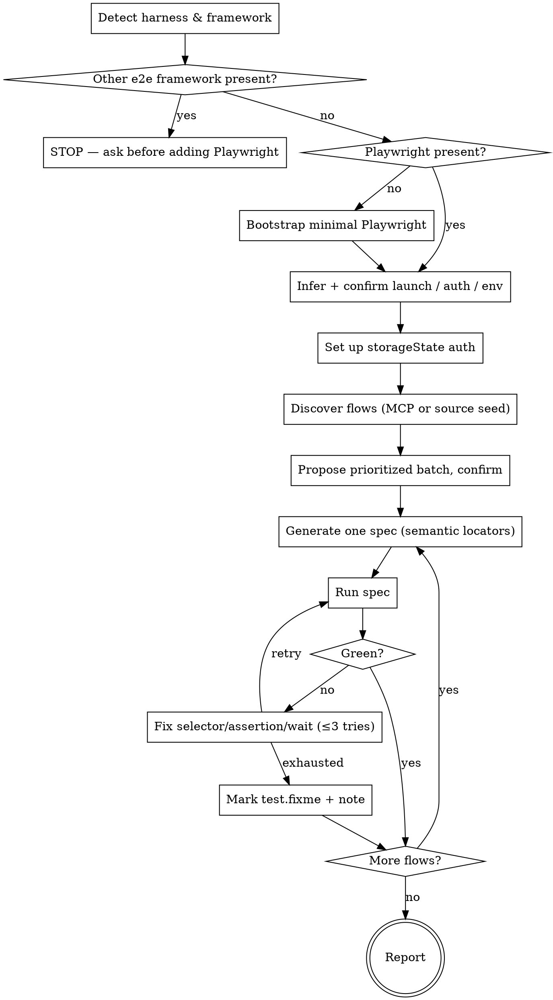

# Auto-Generate E2E Tests (Playwright)

## Overview

Generated e2e tests that were never executed are usually wrong — selectors mismatch, timing is off, auth is missing. This skill is **live-primary**: it drives the *running* app to capture real selectors and assert against the real DOM, then **verifies every spec to green** before reporting. A flow that can't be made green honestly is left as `test.fixme` with a diagnostic note — never faked by weakening an assertion or pasting blanket waits.

## When to Use

- "Generate e2e tests for this app" / "write Playwright tests"
- "Test the login (or checkout, signup, …) flow end to end"
- "Auto-generate browser tests for my web app"

**Don't use for:** unit or integration tests, API-only tests (no browser), CLI tests, or a repo that already uses a **different** e2e framework (Cypress/Selenium/WebdriverIO) — this skill is Playwright-first and will stop rather than add a second harness.

## Workflow

## Step 1 — Detect & Gate

Before writing anything, probe the project (inline `cat`/`ls`/grep — no scripts needed):

- **Competing framework?** Look for `cypress/`, `cypress.config.*`, `wdio.conf.*`, Selenium deps. If found → **STOP.** Tell the user this skill is Playwright-first and a second harness is a maintenance smell; proceed only if they explicitly say "add Playwright anyway."
- **Existing Playwright?** Check `@playwright/test` in `package.json`, a `playwright.config.*`, and any existing e2e dir (`e2e/`, `tests/e2e/`, `playwright/`). If present, conform to it — never clobber config.
- **Discovery mode?** Check whether a Playwright MCP server is available. Announce which mode you'll use: **MCP** (preferred — read the real accessibility tree) or **runner fallback** (spec-and-run + `--trace`/`show-report` convergence).
- **Launch / auth / env (infer → confirm):** read `package.json` scripts, README, and `.env.example` to guess the dev command, base URL, whether auth exists, and the target environment. Present your guesses in **one** confirmation and ask only for what you genuinely can't find (test credentials). Ask once: **"Is the app I'll drive a throwaway/test environment?"** — this gates destructive flows in Step 6.

## Step 2 — Bootstrap Minimal (only if no Playwright)

If and only if no Playwright setup exists, scaffold the bare minimum and nothing more:

- Install `@playwright/test` (match the project's package manager) and browsers (`npx playwright install`).
- Write a minimal `playwright.config.ts`: `baseURL` → the confirmed dev server, a `webServer` block to start it, the test dir, and the `storageState` setup project from Step 3.
- Create one test dir (default `e2e/`). No reporters, sharding, or device matrices — that's not this skill's job.

## Step 3 — Auth via `storageState`

For any authenticated flow, use Playwright's standard pattern: a **`global.setup`** project that logs in once through the UI and saves `storageState` to disk; authenticated specs declare `storageState` so they start logged in. This keeps specs fast and isolated. Never hardcode credentials in specs — read them from env/config.

## Step 4 — Discover & Propose Flows

Seed candidate flows from the frontend **source** (routes, pages, forms, nav links), then refine against the **live** app (MCP snapshot, or a quick navigation pass). Prioritize **critical paths first**: auth → core CRUD → primary value flows (checkout/submit) → secondary navigation. Present the prioritized candidate list and let the user confirm or narrow the batch. If the user named a single flow, just do that one.

## Step 5 — Generate (Strict Semantic Locators)

Write one spec per flow. **Locators are semantic-only:**

| Prefer | Avoid |
|--------|-------|
| `getByRole(name=…)`, `getByLabel`, `getByText`, `getByTestId` | `getByRole` ✗ CSS selectors, XPath, `nth-child`, class chains |

There is **no CSS/XPath fallback.** When a control has no accessible name and no `data-testid`, do **not** invent a brittle selector — record a **recommendation** to add a `data-testid` (control description + suggested id) and, if it blocks the flow, mark that spec `test.fixme`. **Never edit the app's source** to add test hooks; only recommend.

Keep specs flat and readable. Suggest a Page Object Model only if the suite grows large — don't impose it.

## Step 6 — Verify Loop (Bounded, Honest)

Run each generated spec (`npx playwright test <file>`). On failure, inspect the **real** evidence — error message, `--trace`, `npx playwright show-report`, or the live MCP DOM — and fix the selector, assertion, or wait. Retry up to **~3 times**.

- **Green** → keep the spec.
- **Still red after the bound** → mark `test.fixme` with a one-line note explaining what blocked it (e.g. "no accessible name on submit button; needs data-testid").
- **Never** force green: don't relax an assertion to `toBeTruthy`, don't add blanket `waitForTimeout`, don't comment out the failing check.

**Destructive flows:** if the user confirmed a throwaway/test env (Step 1), verify mutation flows (create/delete/update) live. If the env is real or unknown, generate them but leave them `test.fixme` with a note. **Irreversible actions (payments, real emails) default to `test.fixme` regardless of environment** unless the user explicitly green-lights them.

## Common Mistakes & Red Flags — STOP

- Falling back to CSS/XPath/`nth-child` when no semantic locator exists. → Recommend a `data-testid` instead.
- Faking green: weakening an assertion, adding blanket waits, or commenting out a check to make a flaky spec pass.
- Clobbering an existing `playwright.config.*` or e2e dir layout.
- Adding Playwright next to an existing Cypress/Selenium suite without explicit user opt-in.
- Running mutation/payment flows against an environment whose disposability you didn't confirm.
- Editing the app's component source to add test hooks (only recommend).
- Reporting specs as done without actually running them.

If any apply, **stop and correct course** before continuing.

## Reporting

When done, report: discovery mode used (MCP vs runner); flows discovered and which were generated; per-spec status (green vs `test.fixme` + why); `data-testid` recommendations grouped by component; and any flows skipped for environment-safety reasons.
