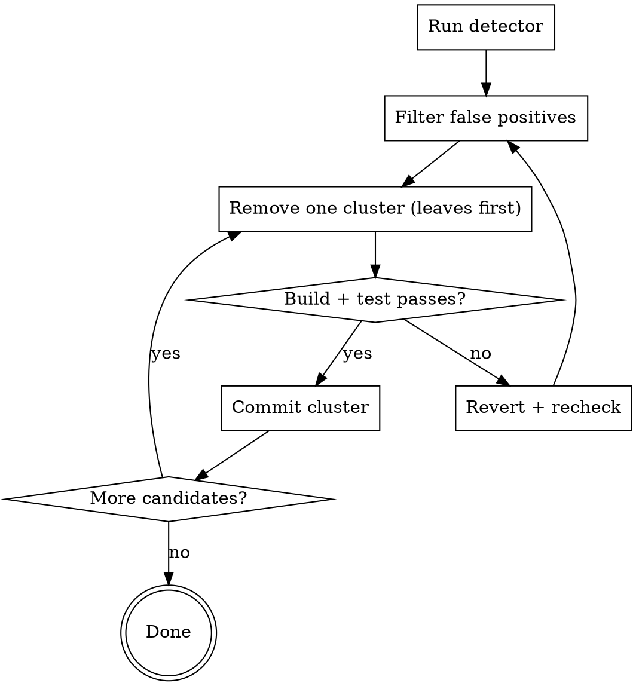

# Dead Code Cleanup (Go & TypeScript)

## Overview

A detector's report is a **candidate list, not a hit list**. Every finding must be cross-checked against the language's escape hatches (reflection, dynamic dispatch, public API, generated code, build tags) before deletion. Remove in leaves-first order, with build + test between clusters, one cluster per commit.

## When to Use

- "Clean up dead code in this repo"
- "Find unused functions / exports / types"
- "What can I delete safely?"
- Pre-release cleanup or post-feature-removal sweep

**Don't use for:** dependency-only cleanup (run `go mod tidy` / `knip --dependencies`), refactoring live code, or eyeball deletions without a detector.

## Workflow



## Detectors

| Lang | Command | Notes |
|------|---------|-------|
| Go | `deadcode -test ./...` | `go install golang.org/x/tools/cmd/deadcode@latest`. Whole-program reachability — strongest signal. |
| Go | `staticcheck -checks U1000 ./...` | Unused unexported symbols. Misses some interface satisfaction cases. |
| TS | `npx knip` | Files, exports, types, deps. **Configure entry points first** or output is noise. |
| TS | `npx ts-prune` | Unused exports, lighter fallback. |
| TS | `tsc --noUnusedLocals --noUnusedParameters` | Locals & params only. |

## False Positives — Always Check

| Trap | Language | What to do |
|------|----------|-----------|
| Reflection / `reflect.*`, `json.Marshal`, struct tags | Go | Search for `reflect.` and tag usage. Default KEEP. |
| Stdlib-interface method names (`MarshalJSON`, `ServeHTTP`, `String`, `Error`, `Read`, `Write`, `Close`) | Go | KEEP — interface dispatch invisible to call-graph. |
| `init()` | Go | Side-effect registration (`sql.Register`, codecs). KEEP unless proven inert. |
| Build tags (`//go:build linux`) | Go | Re-run detectors per `GOOS`/`GOARCH`. |
| Generated files (`*.pb.go`, `mock_*.go`, `wire_gen.go`, `// Code generated`) | Go/TS | Never hand-edit. Fix the source and regenerate. |
| Exported symbol in a library module (`pkg/`, package consumed by other repos) | Go/TS | KEEP unless external consumers verified. Flag for owner review. |
| Framework conventions (Next.js `pages/`/`app/`, route handlers, `getServerSideProps`, NestJS decorators, RSC) | TS | Configure detector entry points; KEEP if framework-invoked. |
| Dynamic imports / string-based requires (`` import(`./plugins/${name}`) ``) | TS | Symbol may appear in a string literal. KEEP. |
| Decorators / DI (NestJS, TypeORM, class-validator) | TS | Methods invoked via metadata. KEEP. |
| `import type` consumed cross-package | TS | Type-only re-exports look unused. KEEP if external consumer. |
| Test fixtures, `testdata/`, Storybook, MDX | Go/TS | Never delete from detector output alone. |

When unsure: `rg -n '\bSymbolName\b'` across the repo and known consumers. One match in a string literal is enough to keep it.

## Removal Order — Leaves First

1. Unused private helpers with no callers.
2. Unused unexported types/constants referenced only by step 1.
3. Exported symbols, **only after** confirming no external consumers.
4. Now-empty files.
5. Now-unused dependencies (`go mod tidy`, `knip --dependencies`).

After each cluster (≤ ~10 symbols, one logical group):

```bash
# Go
go build ./... && go test ./...

# TS
npx tsc --noEmit && npm test
```

Green → commit (`chore: remove unused helpers in <pkg>`). Red → revert that cluster, recheck false positives. One cluster per commit; never bundle behavior changes.

## Common Mistakes & Red Flags — STOP

- Deleting straight from the detector dump without filtering.
- Deleting exported symbols from a library without checking external consumers.
- Hand-editing generated files (regenerate instead).
- Deleting an `init()` without proof of no side effect.
- Deleting a method whose name matches a stdlib interface (`ServeHTTP`, `MarshalJSON`, …).
- Symbol name appears in a string literal anywhere → likely reflective; KEEP.
- Skipping `go test` / `npm test` between clusters — reflection-driven code only fails at runtime.
- Detector reports >30% of files as dead → config issue, not real code death.
- One huge "remove dead code" commit instead of per-cluster commits.

If any of these apply, **stop, re-check, and split into smaller clusters**.

## Reporting

When done: tools used, raw candidate count, kept-count grouped by false-positive category, removed-count grouped by cluster/commit, LOC delta, and anything flagged "probably dead but needs owner sign-off".
