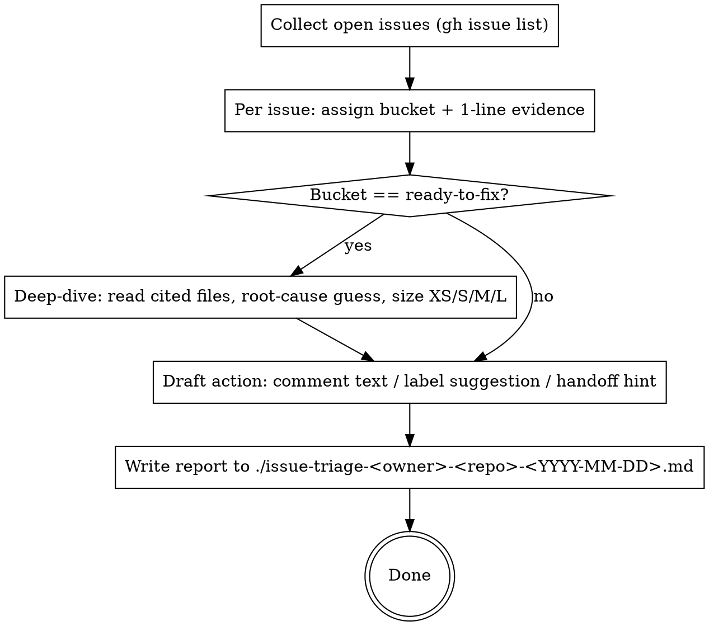

# Triage GitHub Issue Backlog (Read-Only)

## Files in this skill

| File | When to load |
|---|---|
| `references/bucket-rubric.md` | Step 2 — assigning a bucket. Rubric + counter-examples for each of the 6 buckets. |
| `references/draft-comments.md` | Step 4 — exact wording for `needs-info`, `duplicate`, `stale` draft comments. |
| `references/report-template.md` | Step 5 — the exact markdown skeleton for the output file, including the `devpilot-resolve-issues` handoff footer. |

## Overview

End-to-end loop that takes the open-issue backlog of one GitHub repo and produces a single local markdown report classifying each issue, drafting follow-up actions, and (for `ready-to-fix` only) deep-diving into the code. **Nothing is posted to GitHub.** The user is the one who decides whether to act on the report.

**Core principle:** Read-only against GitHub. Every proposed mutation lives in the report as a draft. Anything else turns this skill into a half-baked `devpilot-resolve-issues` and breaks the boundary that makes triage safe to run unattended.

## When NOT to Use

- Creating new issues from a fresh code scan → `devpilot-scanning-repos`.
- Actually fixing the `ready-to-fix` shortlist → hand the report to `devpilot-resolve-issues`.
- Reviewing a PR the user already opened → `devpilot-pr-review`.
- A single ad-hoc bug report — just discuss it directly, no triage report needed.

## The 6 Buckets (exhaustive — pick exactly one)

| Bucket | Meaning |
|---|---|
| `ready-to-fix` | Clear scope, reproducible, small enough to fix without a design discussion. Eligible for `devpilot-resolve-issues`. |
| `needs-info` | Real candidate but blocked on missing repro / env / expected behavior from the reporter. |
| `needs-design` | Real problem; solution requires a trade-off discussion or product decision before code. |
| `duplicate` | Same as another open or closed issue. **Must** cite the other issue number. |
| `stale` | Outdated, abandoned, or no longer relevant. Recommend closing. |
| `out-of-scope` | Legitimate request, but belongs in a different repo or product. |

Pick exactly one. If torn between two, see `references/bucket-rubric.md` for tie-breakers.

## The flow



## Steps

### 1. Collect

```sh
gh issue list --repo <owner>/<repo> --state open --limit 100 \
  --json number,title,body,labels,author,createdAt,updatedAt,comments
```

Honor any user-provided filter (`--label`, `--author`, age). If the user didn't give one, take everything open.

### 2. Classify (batch)

For each issue, in order, assign **exactly one** of the 6 buckets and write a 1-line evidence string. Examples:

- `ready-to-fix` — "well-scoped: cited file + line range + suggested fix"
- `needs-info` — "no repro steps, no env, no expected behavior"
- `needs-design` — "API shape change touches 3 callers, requires decision"
- `duplicate` — "duplicates #88 (same root cause, same files)"
- `stale` — "last activity 18 months ago, references removed module"
- `out-of-scope` — "feature request belongs in `<other-repo>`"

If unsure between buckets → consult `references/bucket-rubric.md`. Do not invent new buckets.

### 3. Deep-dive (ready-to-fix only)

For every issue bucketed `ready-to-fix`:

1. Read the files cited in the issue body (use `Read`, not `gh`).
2. Confirm the issue is reproducible from what the code shows. If the deep-dive reveals it's actually `needs-design` or `needs-info`, **demote** the bucket and skip the size estimate.
3. Note suspected root cause in 1–2 sentences.
4. Estimate fix size: `XS` (< 30 min, single file), `S` (< 2h, ≤ 3 files), `M` (half-day, multi-file or new dependency), `L` (split into multiple issues first).

Do not deep-dive issues in any other bucket — that's wasted work.

### 4. Draft actions

For each issue, draft (do not post) what would close the loop:

| Bucket | Draft |
|---|---|
| `ready-to-fix` | 1-line handoff hint for `devpilot-resolve-issues`, plus any code-level note from deep-dive. |
| `needs-info` | Paste-ready comment asking the missing questions. Use template in `references/draft-comments.md`. |
| `needs-design` | Paste-ready comment listing the trade-offs that need decisions. |
| `duplicate` | Paste-ready close-comment linking the canonical issue. |
| `stale` | Paste-ready close-comment with rationale. |
| `out-of-scope` | Paste-ready close-comment naming the right destination. |

Also propose 1–3 labels per issue (e.g. `triage:ready`, `triage:needs-info`). Labels are suggestions, not applied.

### 5. Write the report

Output filename: `./issue-triage-<owner>-<repo>-<YYYY-MM-DD>.md` (in the cwd, not `/tmp`, not `docs/`).

Use the exact skeleton in `references/report-template.md`. The skeleton already includes:
- Summary counts per bucket
- Per-issue section in spec order
- Footer with the copy-pasteable command to feed `ready-to-fix` issue numbers into `devpilot-resolve-issues`

### 6. Stop

Tell the user: report written, bucket counts, suggested next move (usually "review the `ready-to-fix` section, then run `devpilot-resolve-issues`"). **Do not** also produce a prioritization plan, suggested PR groupings, or "order of attack" — that's the user's call, not yours.

## Hard rules

- **Read-only against GitHub.** Never run `gh issue comment`, `gh issue close`, `gh issue edit`, `gh label create/edit/add`, `gh issue lock`, etc. If you catch yourself reaching for any `gh` write subcommand, stop.
- **Exactly 6 buckets.** No new ones, no merging, no "needs-info-or-design".
- **Deep-dive only for `ready-to-fix`.** Reading code for `stale` issues is wasted work.
- **No prioritization.** Bucket + size is what we offer. Order is the user's job.
- **Output path is `./issue-triage-<owner>-<repo>-<YYYY-MM-DD>.md`** — not `/tmp`, not stdout-only. (If the user explicitly names a different path, honor it — user instructions beat the default. Without an explicit override, use the default.)

## Common Mistakes

| Mistake | Fix |
|---|---|
| Inventing new buckets ("Fix Soon", "Maybe") | Pick one of the 6. If torn, see `references/bucket-rubric.md`. |
| Saying "what to do" instead of writing the comment | Draft the literal comment text. Paste-ready means paste-ready. |
| Skipping the deep-dive for `ready-to-fix` | A bucket without a size estimate isn't really `ready-to-fix`. Read the cited files. |
| Writing to `/tmp` or printing inline only | The user wants a file in the repo cwd they can hand off. |
| Adding an "order of attack" section | Out of scope. Triage classifies; humans prioritize. |
| Calling `gh issue comment` because "the user obviously wants it posted" | They don't. The whole point of this skill is the read-only boundary. |

## Red Flags — STOP

- About to type `gh issue comment` / `gh issue close` / `gh issue edit` / `gh label add`
- About to invent a 7th bucket
- About to deep-dive a `stale` or `duplicate` issue
- About to write the report to `/tmp/`
- About to add a "recommended PR ordering" section

All of these mean: stop, re-read the Hard rules, fix course.
