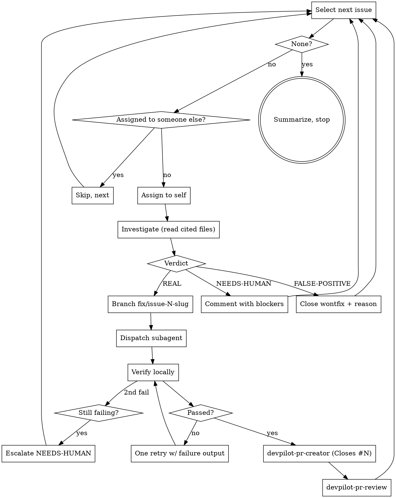

# Resolve GitHub Issues (Loop Until Done)

## Files in this skill

| File | When to load |
|---|---|
| `references/verdict-comments.md` | Step 4 — exact comment bodies for the three verdicts. |
| `references/subagent-spec.md` | Step 6 — the spec you hand to `superpowers:subagent-driven-development`. |

## Overview

End-to-end loop that takes open GitHub issues from triage to reviewed PR, one at a time, until the filter returns no matches. Each issue ends in exactly one of three states: **closed with reason** (false positive), **escalated with questions** (needs human), or **reviewed PR opened** (real). Nothing else is a valid terminal state.

**Core principle:** No fix without a verdict, no code without a subagent, no PR without a review. Anything else breaks the loop and accrues silent debt.

## When NOT to Use

- Filing new issues from a scan → `devpilot-scanning-repos`.
- Reviewing a single PR the user already has open → `devpilot-pr-review`.
- A one-off bug report with no GitHub issue behind it → fix it directly; you don't need the loop.
- Repos where the caller lacks write access — you cannot assign, branch, or PR. Stop and tell the user.

## The loop



## Workflow

### 0. Preflight — once, not per issue

Run in parallel:

```bash
gh repo view --json nameWithOwner,defaultBranchRef   # identify repo + default branch
gh auth status                                        # must be logged in
gh api user --jq .login                               # who is "me"?
git rev-parse --abbrev-ref HEAD                       # starting branch
git status --porcelain                                # working tree clean?
```

**Stop and ask the user if:**

- Working tree has uncommitted changes — commit, stash, or abort. You cannot branch safely otherwise.
- `gh auth status` is not logged in.
- The repo has zero matching open issues — confirm the filter before looping on nothing.

**Establish the filter.** Default: `is:open no:assignee` plus the labels the user cares about (e.g., `repo-scan`, `bug`). If the user said "all issues" but there are >20, confirm the scope before starting. Save the filter — the loop reuses it every iteration.

### 1. Select the next issue

```bash
gh issue list \
  --state open \
  --search "<filter-terms> no:assignee sort:created-asc" \
  --limit 1 \
  --json number,title,body,labels,url,author
```

If the result is empty → go to step 11 (summarize & stop).

### 2. Assign to self

```bash
gh issue edit <num> --add-assignee @me
```

If the issue is already assigned to someone else, **skip it and move on** — do not steal assignments, even if it looks abandoned. Leave it for the owner.

### 3. Investigate — you MUST read the cited code

Read the full issue body. If the issue was filed by `devpilot-scanning-repos` it contains an `Evidence` block with a file and line range. For every verdict you render, you MUST:

- Open the cited file and read the cited line range **in the current HEAD**, not from the issue body.
- `git log --oneline -- <file>` around the cited lines — was this already fixed since the issue was filed?
- `grep`/ripgrep for callers, tests, and related constants touching the cited code.
- If the issue gives a reproduction (a command, a failing test), run it.

**A verdict based solely on reading the issue body is speculation.** Issues can be stale, scanners hallucinate, and line numbers drift.

### 4. Render a verdict — exactly one

| Verdict | When | Action |
|---|---|---|
| **REAL** | You traced the code and reproduced / confirmed the bug, gap, or risk. | Proceed to step 5. **Stay assigned** until the PR merges — do not unassign mid-PR; `Closes #N` on merge closes the issue cleanly when it's authored by the assignee. |
| **FALSE-POSITIVE** | You traced the code and the premise is wrong — already fixed, wrong file, misread of the code, scanner hallucination, or pre-existing and intentional. | Post the FALSE-POSITIVE comment from `references/verdict-comments.md`, close with the `wontfix` label, unassign. Next issue. |
| **NEEDS-HUMAN** | Concern is real but fixing requires domain knowledge you don't have — business logic, product decisions, contracts with external services. | Post the NEEDS-HUMAN comment with 1–3 concrete questions, unassign. Next issue. |

**Do not classify as REAL just to "take a shot."** False positives close in 60 seconds; wrong REAL verdicts spawn subagents that produce useless diffs and poison the PR history.

### 5. Branch for the fix

```bash
git switch <default-branch>
git pull --ff-only
git switch -c "fix/issue-<num>-<short-slug>"
```

Slug: derive from the issue title — kebab-case, 3–5 ASCII words. Example: issue #42 "Sanitize shell input in cmd/devpilot/run.go" → `fix/issue-42-sanitize-shell-input`.

### 6. Fix via subagent-driven-development

Invoke `superpowers:subagent-driven-development`. Hand it the spec from `references/subagent-spec.md`, filled in with:

- The issue URL.
- The verbatim `Evidence` block from the issue (if present).
- The specific files and line ranges to read first.
- Acceptance criteria (how the subagent knows it's done — e.g., "new test covering the case passes", "existing flaky test X is now deterministic").
- The exact verification commands (`make test`, `make lint`, or project-specific).

**Do NOT fix in the main context.** The main context is the orchestrator. Coding lives in the subagent. One subagent per issue, with at most one retry if the first attempt fails verification.

### 7. Verify — yourself, not the subagent's report

After the subagent returns, run the verification commands **in the main context** on the fix branch. Trust-but-verify: the subagent can misreport — innocently or because a test harness is broken.

- Everything passes → step 8.
- First failure → one retry: re-dispatch the subagent with the verbatim failing output and the current diff.
- Second failure → reclassify as NEEDS-HUMAN: comment on the issue with the failing output and a link to the branch (push it first, draft state), unassign, next issue.

### 8. Create the PR

Invoke `devpilot-pr-creator`. Extra constraints this skill adds on top of that skill:

- The PR body MUST contain `Closes #<issue-num>` on its own line so GitHub auto-closes the issue on merge.
- The PR title should describe the fix, not repeat the issue number.
- Base branch = repo default, unless the user specified a different stacking target at preflight.

### 9. Review the PR

Invoke `devpilot-pr-review` against the PR number you just created. Post the review.

- All findings `low` / informational → continue to next issue.
- Any finding `high` → treat as NEEDS-HUMAN: leave the review posted, report the PR and the finding to the user, and **do not silently fix your own PR in this iteration**. The review exists precisely because your fix might be wrong. Move to the next issue.

Then post the **Real → PR opened** comment template from `references/verdict-comments.md` on the issue itself (not only the PR), so subscribers see the resolution trail without having to click into the PR. The issue stays open and assigned to you — `Closes #<num>` in the PR body will close it on merge.

### 10. Return to step 1

### 11. Final summary

When the loop terminates, print:

```
## Issue resolution complete

Filter: <filter-terms>
Processed: <N> issues

- REAL → PR opened: <count>    (#<issue>→PR#<pr>, ...)
- FALSE-POSITIVE → closed:  <count>    (#<issue>, ...)
- NEEDS-HUMAN → escalated:  <count>    (#<issue>, ...)
- Skipped (assigned to others): <count>

Next: review the PRs now awaiting your eyes.
```

## Termination conditions

The loop ends when **any** of these is true — not before:

1. Step 1 returns zero matching issues.
2. The user interrupts.
3. **Three-strike rule:** three consecutive iterations resolve to NEEDS-HUMAN or failed verification. Something is wrong with the filter or scope — stop and ask the user before burning more time.

"I've done enough" is not a termination condition. The skill is defined as a loop. If the loop feels too long, narrow the filter — don't abandon mid-sweep.

## Hard rules

1. **One issue per PR.** Never bundle fixes across issues even when they touch the same file. Rebase conflicts are cheap; mixed-intent reviews are expensive.
2. **Never self-approve.** The `devpilot-pr-review` pass is a finding generator, not an approval stamp. A "clean" review from the skill does NOT mean "merge it now" — it means "safe to hand to a human."
3. **Never re-assign to someone else.** Either you resolve the issue or you unassign and leave a reasoned comment.
4. **Never edit an issue's title or body.** Comment on it. The author's words stay intact.
5. **Never mass-close.** Each FALSE-POSITIVE gets its own comment quoting the code that proves the premise wrong.
6. **Never open a PR without `Closes #N`.** The issue will stay open forever and the loop will re-pick it.
7. **Never push to `main` / the default branch.** Always work on `fix/issue-<num>-...`.

## Red flags — STOP and reset

| Thought | What's actually happening |
|---|---|
| "I'll just fix this without reading the cited file" | Verdict without investigation = guessing. Read the file at current HEAD first. |
| "Assignment is just ceremony, skip it" | Two agents on the same issue = two PRs and a race. Assign. |
| "This is a small change, I'll do it in the main context" | Subagent protects your context window; losing it mid-loop costs far more than dispatching. Dispatch. |
| "Let me batch these three related issues into one PR" | The next reviewer, and the next `/resolve-issues` run, can no longer separate them. One PR per issue. |
| "The review found something but I can fix it now" | The review exists to stop exactly this. If the fix is trivial, open a follow-up commit from the user's hand — not yours. |
| "Close as FALSE-POSITIVE, nobody will notice the weak reasoning" | You will notice in 4 weeks when the same scanner refiles it. Quote the code or reclassify. |
| "I've done two issues — I'll stop" | The skill is defined as a loop until empty or three-strike. Either narrow the filter or continue. |
| "The subagent said tests pass, so I don't need to run them" | Subagents misreport. Run the commands yourself. |
| "I'll skip `Closes #N` since the PR title mentions the issue" | Title text doesn't autolink. Without the magic word the issue stays open. |
| "I'll assign and then un-assign later if I don't fix it" | Unassign in the same iteration the verdict demands it (FALSE-POSITIVE / NEEDS-HUMAN). Dangling assignments leak. |

## Common mistakes

- **FALSE-POSITIVE comment with no code quote.** "Not a bug" is dismissal, not a verdict. Quote the file at current HEAD.
- **Subagent dispatched with only "fix the issue".** Subagents aren't telepaths. Paste the Evidence block and list the files.
- **Running verification inside the subagent and trusting its report.** Run the commands yourself after.
- **Picking up issues assigned to others.** Even if they look abandoned — leave a comment asking, move on.
- **Creating a fix branch off a stale default branch.** Always `git pull --ff-only` first.
- **Opening the PR as "ready" before the review pass.** Open as draft, run review, then mark ready if clean.
- **Letting the loop run over issues the user didn't scope to.** Honor the filter you agreed on in preflight. If new issues appear, they get the next `/resolve-issues` run.

## Cross-references

- Picking a subagent-friendly task spec → `superpowers:subagent-driven-development`.
- PR body, template selection, and Review Guide rules → `devpilot-pr-creator`.
- Behavior-first PR review framing → `devpilot-pr-review`.
- How `repo-scan` issues are shaped (Evidence block, labels) → `devpilot-scanning-repos`.

## Acceptance criteria (the "test" this skill is written against)

A correct run produces:

1. Every processed issue ends in exactly one of: closed (FALSE-POSITIVE), escalated with a comment (NEEDS-HUMAN), or has exactly one PR linking `Closes #N`. No issue is left assigned to you without one of those outcomes.
2. No PR exists without a corresponding issue and `Closes #N`.
3. No subagent was dispatched before a REAL verdict.
4. No issue was fixed in the main context instead of via `superpowers:subagent-driven-development`.
5. `devpilot-pr-review` ran against every PR this skill created, and the review was posted.
6. The loop terminated on empty filter, user interrupt, or the three-strike escalation — not arbitrarily after N issues.
7. Final summary was printed with per-issue disposition.
8. No push to the default branch occurred.

If any is violated, the skill failed — correct before continuing.
